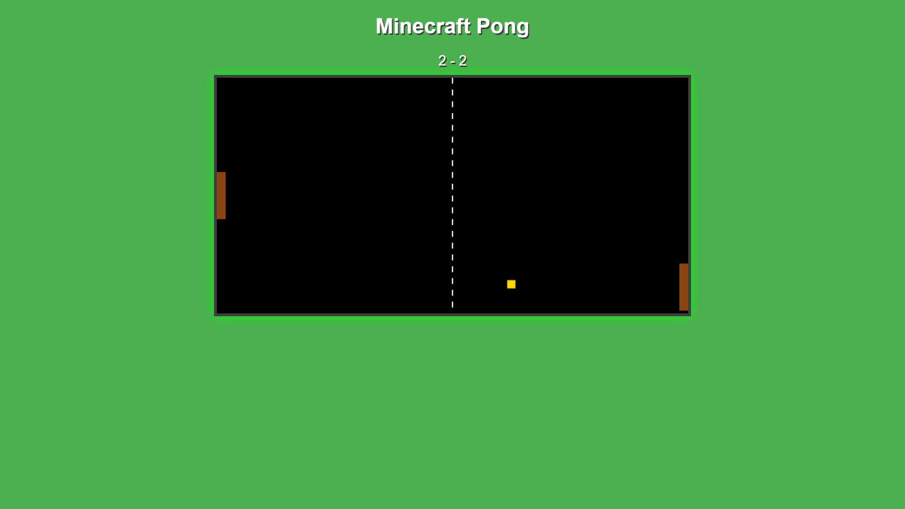

# ⛏️ MinePong 🎾  

A **Minecraft-themed Pong game** built with **JavaScript and HTML5 Canvas**, featuring blocky paddles, pixel-art effects, and smooth gameplay! Inspired by **classic Pong** but with a **Minecraft aesthetic**.  

## 🟩 Features  

✅ **Minecraft-Styled Paddles & Ball** – Blocky, pixel-perfect design  
✅ **AI Opponent** – Smart opponent that adjusts its speed dynamically  
✅ **Soothing Sound Effects** – Light, soft sounds for a relaxing experience  
✅ **Particle Effects** – Pixel-style particles on ball collisions  
✅ **Score Tracking** – Displayed in a Minecraft-themed font  
✅ **Speed Boost Mechanic** – Increases difficulty gradually  

## 🎮 How to Play  

1. **Arrow Up (↑)** – Move your paddle up  
2. **Arrow Down (↓)** – Move your paddle down  
3. **Hit the ball** to bounce it back toward your opponent  
4. **First to 10 points wins!**  

## 🖥️ Installation & Usage  

### Play in Browser  
Simply open `index.html` in any modern browser (Chrome, Firefox, Edge).  

### Run Locally  
1. Clone the repository:  
   ```sh
   git clone https://github.com/yourusername/minepong.git
   cd minepong
   ```
2. Open `index.html` in your browser.  

## 🎨 Customization  

### 🎵 Change Sound Effects  
Replace sounds in `script.js` with **Minecraft-style effects**:  
```js
const paddleHitSound = new Audio("your-minecraft-hit-sound.mp3");
const scoreSound = new Audio("your-minecraft-score-sound.mp3");
const wallBounceSound = new Audio("your-minecraft-wall-sound.mp3");
```

### 🏗️ Modify Theme Colors  
Modify the **paddle**, **ball**, and **background** colors in `script.js`:  
```js
ctx.fillStyle = "#228B22"; // Minecraft Grass Block Green  
ctx.fillStyle = "#8B4513"; // Wooden Paddles  
ctx.fillStyle = "#FFD700"; // Golden Ball  
```

## 🛠️ Technologies Used  

- **HTML5 Canvas** – Renders the pixel-art game world  
- **JavaScript (ES6)** – Game logic and physics  
- **CSS** – Styling the UI elements  

## 📸 Screenshots  

  

## 🏆 Future Updates  

- **Multiplayer Mode** 👫  
- **Minecraft Biomes as Backgrounds** 🌍  
- **Power-Ups** (Speed boost, Bigger paddles, Randomized effects) 🛠️  

## 🤝 Contributing  

Want to improve **MinePong**? Fork the repo and submit pull requests!  

## 📜 License  

Licensed under the **MIT License** – Feel free to modify and share!  

---

## Made by 
🔥 **Enjoy playing MinePong!** 🚀⛏️