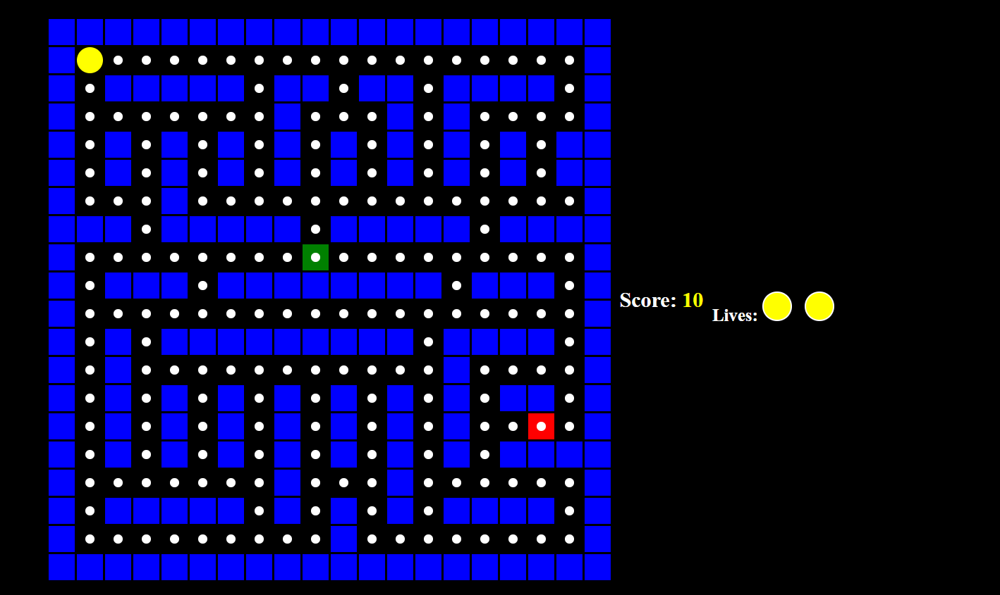

# Pac-Man

## Description 📃
This is a classic Pac-Man game built using HTML, CSS, and JavaScript. The objective of the game is to navigate Pac-Man through a maze, eat all the pac-dots, avoid the ghosts, and try to win the game!

## Functionalities 🎮
- **Pac-Man Movement**: Use arrow keys to move Pac-Man up, down, left, or right.
- **Pac-Dots**: Eat pac-dots to increase your score.
- **Power Pellets**: Eat power pellets to temporarily turn ghosts blue and make them vulnerable.
- **Ghosts**: Avoid ghosts that move around the maze. If a ghost touches Pac-Man, a life is lost.
- **Fruits**: Occasionally, fruits appear in the maze. Eat them to gain extra points.
- **Lives**: The player starts with 3 lives. The game ends when all lives are lost.
- **Winning Condition**: Collect all pac-dots to win the game.
- **Game Over**: The game ends when Pac-Man loses all lives and gets caught.

## How to Play? 🕹️
1. **Start the Game**: Open the game in your web browser. Pac-Man starts at the initial position in the maze.
2. **Move Pac-Man**: Use the arrow keys on your keyboard to move Pac-Man.
   - **Arrow Up**: Move up
   - **Arrow Down**: Move down
   - **Arrow Left**: Move left
   - **Arrow Right**: Move right
3. **Collect Pac-Dots**: Navigate through the maze and collect all the pac-dots to increase your score.
4. **Eat Power Pellets**: Eat power pellets to turn ghosts blue and make them vulnerable. You can eat blue ghosts for extra points.
5. **Collect Fruits**: Occasionally, fruits appear in the maze. Eat them to gain extra points.
6. **Avoid Ghosts**: Avoid the ghosts moving around the maze. If a ghost touches Pac-Man, a life is lost.
7. **Game Over**: The game ends when Pac-Man loses all lives. A message will display "Game over! You lost!".
8. **Win the Game**: Collect all pac-dots to win the game. A message will display "Congratulations! You won!".

## Screenshots 📸

